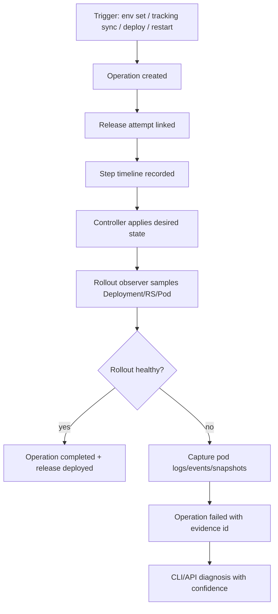

# Fugue Operation Evidence and Release Observability Plan

最后更新：2026-07-03

本文把本轮围绕 `app env set`、image tracking sync、deploy rollout、临时 migration 模式部署所暴露出来的可观测性问题，沉淀成可执行的 Fugue 系统性改造方案。

本文只记录平台通用能力，不记录任何 secret、真实 API key、私有环境变量值，也不把某一个业务项目、仓库、镜像、邮箱、主机名或事故样本写成专用逻辑。

## 1. 背景

本轮部署过程中，操作者原本希望得到的体验是：

```text
git push -> CI 构建新镜像 -> Fugue 自动/手动同步最新镜像 -> 必要 schema 迁移 -> 新版本健康上线 -> CLI 明确告诉用户结果
```

实际操作过程中出现了多个让人困惑的现象：

1. `fugue app env set ... DB_SCHEMA_MIGRATION_MODE=migrate --wait` 触发的是旧稳定镜像的重新部署，而不是自动把 tracking 已发现的新 digest 一并部署。
2. `fugue app release tracking sync ... --wait` 同时涉及 image import operation 和 queued deploy operation，CLI 输出中 import/deploy 的状态容易混在一起理解。
3. 新镜像第一次 deploy 失败后，operation 里没有保留足够的 Kubernetes pod 证据、previous container logs、事件和 rollout 快照，导致无法 100% 复盘应用启动失败的直接原因。
4. 后续一次 migration 模式 deploy 失败时，previous logs 明确记录到 `startup failed: apply schema: ERROR: deadlock detected (SQLSTATE 40P01)`，说明在有日志证据时是可以精确判断原因的。
5. `managed_app_rollout` 当前会把 transient pod failure 当作 deploy failure 返回，但返回前没有把完整证据持久化到 operation 或可查询诊断表里。

其中第 1 点和第 2 点属于已可由代码路径证明的 Fugue 行为语义；第 3 点才是本方案要优先修复的核心问题：**平台没有留下足够的 durable evidence，让下一次失败可以被 100% 归因。**

## 2. 已确认事实与禁止推断边界

### 2.1 可 100% 确认的事实

以下事实可以通过 Fugue 当前代码路径或线上 operation/pod evidence 直接证明：

- `app env set` 修改 app env 后，会基于 app 当前 deploy baseline 创建 `OperationTypeDeploy`，不会自动拉取 image tracking 上刚看到的最新 digest。
  - 相关代码：`internal/api/app_config.go`
  - 相关函数：`handlePatchAppEnv`
  - baseline 来源：`internal/api/app_recovery.go` 中的 `recoverAppDeployBaseline`
- image tracking manual sync 先创建/等待 import operation；import 成功后再 queue deploy operation。
  - 相关代码：`internal/api/app_image_tracking.go`
  - 相关代码：`internal/controller/import_operation.go`
  - CLI 等待逻辑：`internal/cli/app_release.go` 中的 `syncAppImageAndWait`、`waitForAppImageSyncOperation`
- deploy operation 在 controller 中应用 desired state，然后等待 ManagedApp rollout。
  - 相关代码：`internal/controller/controller.go`
  - rollout wait：`internal/controller/managed_app_rollout.go`
- rollout wait 当前会读取 pod failure message，并可能把 transient container exit 作为 deploy failure 返回。
  - 相关代码：`internal/controller/managed_app_rollout.go`
- 某一次 migration 模式失败有明确 previous log evidence：`startup failed: apply schema: ERROR: deadlock detected (SQLSTATE 40P01)`。

### 2.2 不能 100% 确认的内容

以下内容在现有证据下不能 100% 确认，因此不能被写成根因，也不能直接以此为依据修改行为：

- 新镜像第一次 deploy 失败的应用级根因。
- 第一次失败是否一定由缺失 schema migration 引起。
- 第一次失败时具体 pod 的 previous logs、init container 状态、Kubernetes events、readiness/liveness 失败细节。
- 第一次失败时 controller 看到的完整 rollout 状态、ReplicaSet 状态与 Deployment condition 转换过程。

对这类情况，未来系统必须返回明确状态：

```text
confidence=insufficient_evidence
missing_evidence=[previous_container_logs, pod_events, rollout_snapshot, ...]
```

而不是把推测性解释包装成确定结论。

## 3. 目标

### 3.1 用户体验目标

最终用户理想体验：

```text
用户只管 push；Fugue 自动完成构建产物接入、发布、迁移、健康检查、失败解释和可操作修复建议。
```

但在没有证据闭环前，不应先增加更多自动化行为。第一阶段目标是：

```text
每一个 operation、每一个 release attempt、每一个 rollout failure，都能被证据链解释。
```

### 3.2 平台工程目标

- 所有 operation 都有可查询 timeline。
- 所有 deploy/import/release-chain 之间有明确父子关系。
- deploy 失败前必须尽力采集 Kubernetes failure evidence。
- image tracking 的 action evidence 和 decision evidence 可以与 deploy evidence 串起来。
- CLI 输出能区分 import、deploy、rollout、health、migration 等不同阶段。
- 诊断系统必须显式标注置信度：`confirmed`、`evidence_backed`、`probable`、`insufficient_evidence`。
- 当无法 100% 判断根因时，系统必须告诉用户缺少哪些证据，而不是猜。

## 4. 非目标

- 第一阶段不改变 rollout、image tracking、migration、env set 的行为语义。
- 第一阶段不加入 app/project/repo-specific workaround。
- 不把某个业务系统的 migration mode、schema 文件名、镜像 tag、启动命令写死进 Fugue。
- 不把 secret、完整 env、registry token、数据库 DSN、支付密钥写入 evidence。
- 不依赖外部可观测性 SaaS 才能复盘事故；Fugue control plane 自身必须保留关键诊断证据。
- 不在 Prometheus label 中放 app id、digest、operation id、image ref 等高基数字段。

## 5. 核心原则

### 5.1 action record 不等于 decision evidence

Operation 是 action record：它说明系统做了什么。

Decision evidence 说明系统为什么这样做，或者为什么没有做。

示例：

- `OperationTypeDeploy` 只能说明部署被创建。
- image tracking check record 才能说明某次轮询看到哪个 digest、为什么 queue 或 skip。
- rollout evidence 才能说明部署为什么失败、哪个 pod/container 给出了直接信号。

### 5.2 行为变更必须等证据先行

当平台不能 100% 解释失败时，不先改“看起来可能对”的行为。

顺序必须是：

1. 补证据。
2. 用证据复现或证明问题。
3. 再改行为。
4. 用新证据证明行为改动有效。

### 5.3 诊断必须有置信度

所有自动诊断输出都必须带 confidence：

| confidence | 含义 | 是否可作为根因 |
| --- | --- | --- |
| `confirmed` | 有直接原始证据支持，例如 previous log、Kubernetes event、exit code、DB error | 是 |
| `evidence_backed` | 多个直接证据一致，但没有单一 root-cause log | 可作为强结论 |
| `probable` | 证据间接，符合已知模式，但仍可能有其他解释 | 不能当 100% 根因 |
| `insufficient_evidence` | 关键证据缺失 | 不能给根因，只列缺口 |

### 5.4 Evidence 要本地持久化，日志只是辅助

Controller structured logs 适合实时排障，但日志会滚动、丢失、聚合延迟或被采样。关键 evidence 必须写入 control plane database，绑定 operation/release attempt/app。

### 5.5 可观测性不能引入新可用性风险

Evidence 写入失败不能让正常 deploy/import/reconcile 路径失败。采集失败应降级为 evidence row：

```text
evidence_type=collector_error
confidence=insufficient_evidence
error_class=...
```

## 6. 当前基础能力

Fugue 已经有一些可复用基础，不应重复发明：

- image tracking decision history 的方向已在 `docs/image-tracking-observability-plan.md` 中定义，部分实现已经存在。
- image tracking 表/接口已经有可扩展入口。
  - `internal/store/app_image_tracking.go`
  - `internal/store/app_image_tracking_pg.go`
  - `internal/api/app_image_tracking.go`
  - `internal/controller/image_tracking_sync.go`
- operation diagnosis 已有 API surface，可作为 operation evidence/timeline 的上层消费方。
- app observability 已有 metrics/logs/requests/traces 相关入口，可作为 runtime 证据的补充。
- zero downtime rollout incident 文档已经沉淀了 rollout wait 不能只看 Deployment ready 的经验。
  - `docs/zero-downtime-rollout-incidents.md`

本方案不是替换这些能力，而是把 operation、release、rollout、tracking、logs、metrics 串成一条证据链。

## 7. 当前缺口

### 7.1 Operation 没有统一 evidence 表

现在 operation 主要有状态、错误信息、结果信息、时间戳。它不足以回答：

- deploy 失败前 controller 看到哪些 pods？
- 哪个 container 退出？exit code 是什么？reason/message 是什么？
- previous container logs 有什么？
- init container 是否失败？
- readiness/liveness/startup probe 是否失败？
- Kubernetes events 是否出现 `FailedScheduling`、`ImagePullBackOff`、`CrashLoopBackOff`、`Back-off restarting failed container`、PVC mount failure？
- Deployment/ReplicaSet 在每个阶段的 condition 是什么？

### 7.2 Release chain 没有一等 DAG

一次用户感知的发布可能包含：

```text
image tracking check -> import image -> queue deploy -> rollout -> health check -> mark deployed digest
```

现在 import operation 和 deploy operation 是分开的，用户很难从 CLI 一眼看出它们属于同一个 release attempt。

### 7.3 CLI 状态表达混合

`release tracking sync --wait` 既等待 import，也等待 queued deploy。如果输出只显示 operation 状态，很容易误解：

- 哪个 operation completed？
- 哪个 operation pending？
- 当前是在 import、deploy 还是 rollout？
- 失败发生在哪个阶段？

### 7.4 Image tracking 与 deploy outcome 没有完整闭环

当前 image tracking 能知道 `last_seen_digest`、`last_queued_digest`、`last_deployed_digest`，但需要更强的 release attempt 视图来回答：

- 这个 digest 是哪次 check 看到的？
- 哪个 import operation 处理的？
- 哪个 deploy operation 上线的？
- 如果 deploy 失败，失败 evidence 是什么？
- retry 时是否复用同一个 digest 或新建 attempt？

### 7.5 Migration 不是一等阶段

业务使用 `DB_SCHEMA_MIGRATION_MODE=migrate/verify` 这种 env 切换方式完成迁移。Fugue 当前只是把它视为普通 env deploy，因此：

- CLI 不知道这次 deploy 是 migration phase。
- Fugue 不知道 migration 成功后是否应该自动回到 verify。
- 失败时只能看普通 rollout failure，没有 migration-specific evidence。

第一阶段仍不改变行为，但 evidence/timeline 必须能表达：某次 deploy 是由 env patch 触发，env diff 中有敏感字段被 redacted，且用户意图可能是 migration。

### 7.6 Debug bundle 不够一键化

目前排障需要人工组合：

- `app overview`
- operation list/show
- pod inventory
- logs
- metrics
- app image tracking state
- Kubernetes events
- DB 查询
- CLI 本地输出

这会导致证据遗漏、时间窗口不一致、复盘不可重复。

## 8. 方案总览

新增一条平台级证据链：



核心新增能力：

1. `fugue_operation_evidence`：operation 级证据表。
2. `fugue_release_attempts`：用户感知发布尝试。
3. `fugue_release_steps`：发布阶段 timeline。
4. rollout failure collector：在返回失败前采集 pod/container/events/logs。
5. operation evidence/timeline API：OpenAPI-first 暴露。
6. CLI evidence/debug-bundle：一键查看和导出。
7. confidence-aware diagnosis：无法证明时明确输出 `insufficient_evidence`。

## 9. 数据模型设计

### 9.1 `fugue_operation_evidence`

用途：保存 operation 直接证据。它是诊断事实来源，不是最终展示文案。

建议字段：

```text
fugue_operation_evidence
  id text primary key
  tenant_id text not null
  project_id text null
  app_id text null
  operation_id text not null
  release_attempt_id text null
  evidence_type text not null
  source text not null
  severity text not null
  confidence text not null
  subject_kind text null
  subject_name text null
  subject_namespace text null
  subject_uid text null
  observed_at timestamptz not null
  collected_at timestamptz not null
  summary text not null
  message text null
  reason text null
  exit_code integer null
  started_at timestamptz null
  finished_at timestamptz null
  container_name text null
  pod_name text null
  deployment_name text null
  replica_set_name text null
  node_name text null
  redaction_status text not null
  payload_json jsonb not null default '{}'
  payload_version integer not null default 1
  created_at timestamptz not null
```

建议索引：

```text
(operation_id, collected_at)
(app_id, collected_at desc)
(release_attempt_id, collected_at)
(tenant_id, collected_at desc)
(evidence_type, collected_at desc)
```

### 9.2 `evidence_type` 枚举

第一批类型：

```text
operation_created
operation_started
operation_completed
operation_failed
operation_cancelled
image_tracking_decision
image_import_started
image_import_completed
image_import_failed
deploy_apply_started
deploy_apply_completed
rollout_wait_started
rollout_progress
rollout_pod_failure
rollout_container_terminated
rollout_previous_logs
rollout_current_logs
rollout_kubernetes_event
rollout_deployment_snapshot
rollout_replicaset_snapshot
rollout_pod_snapshot
rollout_timeout
readiness_probe_failure
liveness_probe_failure
startup_probe_failure
scheduler_failure
image_pull_failure
volume_mount_failure
collector_error
redaction_notice
```

后续可扩展 migration-specific 类型：

```text
migration_started
migration_completed
migration_failed
migration_schema_version_observed
```

### 9.3 `source` 枚举

```text
api
cli
controller
image_tracking_controller
import_controller
rollout_observer
kubernetes_api
app_logs
metrics_query
manual_debug_bundle
```

### 9.4 `confidence` 枚举

```text
confirmed
evidence_backed
probable
insufficient_evidence
```

要求：

- 原始 Kubernetes termination state、event、previous log 中出现明确错误时，可标记 `confirmed`。
- 多条状态一致但缺少直接日志时，最多 `evidence_backed`。
- 模式匹配、启发式推断只能是 `probable`。
- 缺少关键证据必须是 `insufficient_evidence`。

### 9.5 `payload_json` 约束

`payload_json` 可保存结构化细节，但必须满足：

- 不保存 raw env values。
- 不保存 secret、token、password、DSN、cookie、authorization header。
- log 内容只保留 tail，默认最大字节数受限。
- 每个 payload 必须带 `schema_version`。
- redaction 后仍应保留字段名、长度、hash/fingerprint 或类别，让排障知道“有值但被隐藏”。

示例：

```json
{
  "schema_version": 1,
  "container": "api",
  "terminated": {
    "exit_code": 1,
    "reason": "Error",
    "started_at": "2026-07-03T08:00:00Z",
    "finished_at": "2026-07-03T08:00:04Z"
  },
  "previous_log_tail": "startup failed: apply schema: ERROR: deadlock detected (SQLSTATE 40P01)",
  "redactions": []
}
```

### 9.6 `fugue_release_attempts`

用途：把用户感知的一次发布串起来，而不是让用户手动关联多个 operation。

建议字段：

```text
fugue_release_attempts
  id text primary key
  tenant_id text not null
  project_id text not null
  app_id text not null
  trigger_type text not null
  trigger_actor_type text not null
  trigger_actor_id text null
  source_operation_id text null
  root_operation_id text null
  image_ref text null
  target_digest text null
  previous_digest text null
  desired_source_json jsonb null
  status text not null
  confidence text not null
  started_at timestamptz not null
  finished_at timestamptz null
  failure_operation_id text null
  failure_evidence_id text null
  summary text null
  created_at timestamptz not null
  updated_at timestamptz not null
```

`trigger_type` 建议：

```text
manual_deploy
manual_restart
env_patch
image_tracking_auto
image_tracking_manual_sync
config_patch
resource_patch
```

`status` 建议：

```text
pending
importing
deploying
rolling_out
health_checking
completed
failed
cancelled
superseded
```

### 9.7 `fugue_release_steps`

用途：release attempt 的可读 timeline。

建议字段：

```text
fugue_release_steps
  id text primary key
  tenant_id text not null
  release_attempt_id text not null
  operation_id text null
  step_type text not null
  status text not null
  started_at timestamptz not null
  finished_at timestamptz null
  summary text not null
  evidence_id text null
  payload_json jsonb not null default '{}'
  created_at timestamptz not null
```

`step_type` 建议：

```text
trigger_received
image_tracking_check
image_import
image_import_wait
deploy_queued
deploy_apply
rollout_wait
health_check
mark_deployed_digest
finalize
```

## 10. Controller 采集方案

### 10.1 Rollout failure 返回前必须采集 evidence

在 `internal/controller/managed_app_rollout.go` 中，当前逻辑检测到 pod failure 后会返回失败 message。需要改为：

1. 识别失败 pod/container。
2. 调用 evidence collector。
3. 尽力采集 previous logs、current logs、pod events、Deployment/ReplicaSet/Pod snapshots。
4. 写入 `fugue_operation_evidence`。
5. operation failure message 附带 `primary_evidence_id`。
6. 如果采集失败，也写入 `collector_error` evidence。
7. 最后再返回 failure。

重要：采集失败不能阻塞或掩盖原始 deploy failure。

### 10.2 新增 collector 模块

建议新增文件：

```text
internal/controller/operation_evidence_collector.go
internal/controller/kube_pod_evidence.go
internal/controller/kube_event_evidence.go
internal/store/operation_evidence.go
internal/store/operation_evidence_pg.go
```

collector 接口示例：

```go
type OperationEvidenceCollector interface {
    CaptureRolloutFailure(ctx context.Context, input RolloutFailureEvidenceInput) (*model.OperationEvidenceBundle, error)
    CaptureKubernetesObjectSnapshot(ctx context.Context, input KubernetesSnapshotInput) (*model.OperationEvidence, error)
    CaptureCollectorError(ctx context.Context, input CollectorErrorInput) error
}
```

### 10.3 Pod/container 证据采集范围

每次 rollout failure 至少尝试采集：

- failing pod metadata：name、namespace、uid、labels、annotations fingerprint。
- pod phase、conditions、containerStatuses、initContainerStatuses。
- waiting state：reason/message。
- terminated state：exitCode、reason、message、startedAt、finishedAt。
- lastState.terminated。
- restartCount。
- image、imageID 的 digest/fingerprint。
- readiness/liveness/startup probe 相关 event。
- `kubectl logs --previous` 等价 previous logs tail。
- current logs tail。
- pod events tail。
- owning ReplicaSet snapshot。
- owning Deployment snapshot。

### 10.4 日志 tail 策略

默认策略：

```text
previous logs: last 200 lines or 64 KiB, whichever smaller
current logs: last 100 lines or 32 KiB, whichever smaller
events: last 50 events
```

所有日志进入数据库前必须 redaction。

### 10.5 Kubernetes event 归类

collector 应把常见 event 归类成可诊断 reason：

| Kubernetes reason/message | evidence_type | 诊断方向 |
| --- | --- | --- |
| `FailedScheduling` | `scheduler_failure` | 资源、node selector、taint/toleration、PVC 绑定 |
| `ErrImagePull` / `ImagePullBackOff` | `image_pull_failure` | 镜像不存在、权限、registry 不可用 |
| `FailedMount` | `volume_mount_failure` | PVC/secret/configmap/volume 挂载失败 |
| `BackOff` | `rollout_container_terminated` | 进程持续退出 |
| probe failed | `readiness_probe_failure` / `liveness_probe_failure` / `startup_probe_failure` | 健康检查失败 |

### 10.6 Rollout progress sampling

对于长时间 rollout，不应只在失败时采集一次。应周期性写轻量 evidence：

```text
rollout_progress
  desired_replicas
  updated_replicas
  ready_replicas
  available_replicas
  unavailable_replicas
  observed_generation
  deployment_conditions
```

采样频率要低，避免写放大。建议：

- 开始时写一次。
- 每 30 秒最多写一次。
- 状态变化时写一次。
- 完成或失败时写一次。

## 11. API 设计（OpenAPI-first）

所有 API 变更必须先修改 `openapi/openapi.yaml`，再生成代码。

### 11.1 Operation evidence API

建议新增：

```http
GET /v1/operations/{operation_id}/evidence
GET /v1/operations/{operation_id}/timeline
GET /v1/operations/{operation_id}/debug-bundle
```

`evidence` 支持 query：

```text
type
severity
since
limit
include_payload=true|false
```

默认不返回大 payload/log tail；需要 `include_payload=true` 才返回，并继续执行 redaction。

### 11.2 Release attempt API

建议新增：

```http
GET /v1/apps/{app_id}/release-attempts
GET /v1/apps/{app_id}/release-attempts/{attempt_id}
GET /v1/apps/{app_id}/release-attempts/{attempt_id}/timeline
GET /v1/apps/{app_id}/release-attempts/{attempt_id}/evidence
```

### 11.3 Operation diagnosis 扩展

现有 operation diagnosis 应扩展返回：

```json
{
  "confidence": "confirmed",
  "primary_evidence_id": "evid_...",
  "summary": "container api exited with code 1 during startup",
  "confirmed_cause": {
    "category": "application_startup_failure",
    "source": "previous_container_logs",
    "message": "startup failed: apply schema: ERROR: deadlock detected (SQLSTATE 40P01)"
  },
  "missing_evidence": [],
  "recommended_next_actions": []
}
```

当证据不足：

```json
{
  "confidence": "insufficient_evidence",
  "summary": "deploy failed but Fugue did not capture previous container logs or pod events",
  "missing_evidence": [
    "previous_container_logs",
    "pod_events",
    "deployment_snapshot"
  ],
  "recommended_next_actions": [
    "rerun deploy after operation evidence collector is enabled",
    "check application logs around the operation window"
  ]
}
```

## 12. CLI 设计

### 12.1 Operation commands

新增：

```sh
fugue operation timeline <operation-id>
fugue operation evidence <operation-id>
fugue operation diagnose <operation-id>
fugue operation debug-bundle <operation-id> --output ./bundle.zip
```

示例输出：

```text
TIMELINE
10:01:00 operation_started        deploy op_123
10:01:03 deploy_apply_completed   Deployment/app-123 generation=44
10:01:04 rollout_wait_started     release_key=abc123
10:01:12 rollout_pod_failure      pod/app-123-xyz container=api exit_code=1
10:01:13 rollout_previous_logs    evidence=evid_789 confidence=confirmed
10:01:13 operation_failed         primary_evidence=evid_789

DIAGNOSIS
confidence: confirmed
cause: application startup failure
source: previous container logs
message: startup failed: apply schema: ERROR: deadlock detected (SQLSTATE 40P01)
```

### 12.2 Release commands

新增：

```sh
fugue app release attempts <app>
fugue app release status <app>
fugue app release explain <app> [--attempt <id>]
fugue app release debug-bundle <app> [--attempt <id>] --output ./bundle.zip
```

`tracking sync --wait` 输出应改为 phase-aware：

```text
release attempt: rel_123
image tracking: observed sha256:new
import operation: op_import_123 running -> completed
deploy operation: op_deploy_456 queued -> running
rollout: waiting for app revision abc123
rollout: failed, primary evidence evid_789
```

### 12.3 保持现有命令兼容

不能破坏现有脚本。新增输出应优先：

- 在 human table 中更清晰。
- `--output json` 保持稳定字段并新增可选字段。
- 对旧字段只增不删，除非 major breaking change。

## 13. Debug bundle 设计

`debug-bundle` 是一键可复盘包，默认 redacted。

建议包含：

```text
metadata.json
operation.json
operation_timeline.json
operation_evidence.json
release_attempt.json
release_timeline.json
app_overview.json
image_tracking_state.json
image_tracking_history.json
pod_inventory.json
rollout_snapshots.json
logs_tail.redacted.txt
kubernetes_events.redacted.json
metrics_summary.json
requests_summary.json
redaction_report.json
```

原则：

- bundle 内不包含 secret raw value。
- 所有 redaction 有报告。
- 每个文件记录生成时间、API 版本、Fugue CLI 版本。
- bundle 可以离线分析，不依赖线上日志仍存在。

## 14. Metrics 与 alerts

### 14.1 Prometheus metrics

低基数 metrics：

```text
fugue_operations_total{type,status}
fugue_operation_duration_seconds{type,status}
fugue_operation_evidence_records_total{evidence_type,severity,confidence}
fugue_rollout_failures_total{reason,confidence}
fugue_rollout_failure_evidence_capture_total{result}
fugue_release_attempts_total{trigger_type,status}
fugue_release_attempt_duration_seconds{trigger_type,status}
fugue_image_import_to_deploy_duration_seconds{status}
fugue_deploy_to_ready_duration_seconds{status}
fugue_debug_bundle_generated_total{result}
```

禁止 label：

```text
app_id
project_id
tenant_id
operation_id
release_attempt_id
image_ref
digest
pod_name
container_name
```

### 14.2 Alerts

建议告警：

- rollout failure 增多。
- rollout failure evidence capture failed 增多。
- operation diagnosis 中 `insufficient_evidence` 比例升高。
- image import succeeded but deploy not queued。
- release attempt stuck in importing/deploying/rolling_out。
- controller leader loop lag。
- image tracking check lag。

## 15. Migration 可观测性与未来一等化

### 15.1 第一阶段：只观察，不自动改变行为

当前业务通过 env 控制 migration，例如：

```text
DB_SCHEMA_MIGRATION_MODE=migrate
DB_SCHEMA_MIGRATION_MODE=verify
```

Fugue 第一阶段不理解这个变量的业务含义，但 operation evidence 应记录：

- 触发方式是 env patch。
- 哪些 env key 变化了。
- value 被 redacted。
- deploy 使用的镜像 digest 是哪个。
- deploy failure 是否来自 application logs。

### 15.2 后续阶段：一等 migration phase

在证据链稳定后，可以设计通用 release hooks，而不是硬编码某个 env：

```yaml
release:
  phases:
    - name: migrate
      command: ./migrate
      timeout: 5m
      retries: 0
    - name: serve
      healthCheck: default
```

或者 app spec 中定义 generic pre-deploy job/post-deploy job。届时 Fugue 可以真正实现：

```text
build image -> run migration job -> deploy web -> verify -> mark release complete
```

但这属于未来行为变更，不属于本方案第一阶段。

## 16. 安全与脱敏

### 16.1 Redaction 规则

需要统一 redactor，覆盖：

- env values。
- Authorization/Cookie/Set-Cookie。
- token、password、secret、key、credential、dsn、database_url 等字段名。
- URL query 中疑似 token 的参数。
- 邮箱、银行卡、支付订单号等可能的 PII/支付标识，如果进入日志 tail，应做默认 masking。

### 16.2 Redaction 输出

不要只删除内容。应保留诊断有用信息：

```json
{
  "field": "DATABASE_URL",
  "redacted": true,
  "kind": "secret_like_env",
  "sha256_prefix": "ab12cd34",
  "original_length": 143
}
```

### 16.3 权限

- operation evidence 读取权限应不低于 operation show。
- include payload/log tail 可能需要更高权限。
- debug bundle 生成要记录 audit evidence。

## 17. 实施阶段

### Phase 0：文档、边界与验收标准

目标：固定方案，明确第一阶段只补可观测性，不改 deploy 行为。

产出：本文档、任务拆分、验收标准。

### Phase 1：Operation evidence 基础设施

目标：新增数据模型、store、OpenAPI、API、CLI 基础命令。

产出：

- `fugue_operation_evidence` migration。
- store 接口和 Postgres 实现。
- `GET /v1/operations/{id}/evidence`。
- `GET /v1/operations/{id}/timeline`。
- `fugue operation evidence/timeline`。

### Phase 2：Rollout failure evidence collector

目标：deploy/rollout 失败时自动采集 pod/container/events/logs/snapshots。

产出：

- controller collector。
- previous/current logs tail。
- Kubernetes event capture。
- Deployment/ReplicaSet/Pod snapshot。
- operation failure 关联 primary evidence。

### Phase 3：Release attempt DAG

目标：把 image tracking/import/deploy/rollout 串成用户感知的一次 release attempt。

产出：

- `fugue_release_attempts`。
- `fugue_release_steps`。
- image tracking sync 创建/关联 release attempt。
- import operation 关联 release attempt。
- queued deploy operation 继承 release attempt。
- CLI phase-aware 输出。

### Phase 4：Diagnosis 与 confidence 体系

目标：所有自动诊断带 confidence，不能证明就明确说证据不足。

产出：

- operation diagnosis 扩展。
- release explain。
- missing evidence 列表。
- confirmed/probable/insufficient_evidence 规则测试。

### Phase 5：Metrics、alerts、debug bundle

目标：可运营化，降低人工排障成本。

产出：

- 低基数 metrics。
- evidence capture failure alert。
- debug bundle API/CLI。
- redaction report。

### Phase 6：未来行为改造准备

目标：基于证据决定是否设计更顺滑的 release/migration workflow。

可能方向：

- first-class release phases。
- generic migration/pre-deploy job。
- `push -> release` 自动闭环。
- env patch 与 image tracking sync 的显式组合命令，例如 `fugue app release promote --with-env ...`。

## 18. 测试策略

### 18.1 Store tests

覆盖：

- insert/query operation evidence。
- evidence payload redaction。
- evidence pagination。
- release attempt/steps 状态转换。
- retention cleanup。

### 18.2 Controller unit tests

使用 fake Kubernetes client 覆盖：

- container terminated exit code 1。
- init container failure。
- CrashLoopBackOff。
- ImagePullBackOff。
- FailedScheduling。
- FailedMount。
- readiness probe failure。
- previous logs 存在。
- previous logs 不存在但 collector 写 missing evidence。
- collector error 不掩盖原始 rollout failure。

### 18.3 API contract tests

覆盖：

- OpenAPI generation drift。
- operation evidence response schema。
- timeline response schema。
- debug bundle metadata schema。
- auth/permission。

### 18.4 CLI tests

覆盖：

- human output phase-aware。
- JSON output stable。
- `insufficient_evidence` 显示 missing evidence。
- debug bundle 输出 redaction report。

### 18.5 End-to-end tests

构造通用 synthetic app，不使用真实业务项目名：

- app 启动立即 exit 1，验证 previous logs 被捕获。
- app readiness probe 永远失败，验证 probe evidence。
- fake image pull failure，验证 image pull evidence。
- tracking sync 触发 import + deploy，验证 release attempt 串联。

## 19. 验收标准

本方案第一批完成后，面对一次失败 deploy，Fugue 必须能做到：

1. `fugue operation diagnose <op>` 能输出 `confidence`。
2. 如果 previous logs 中有明确错误，diagnosis 能给出 `confirmed` root cause。
3. 如果 previous logs 缺失，diagnosis 不能猜根因，必须输出 `insufficient_evidence` 和 missing evidence。
4. `fugue operation timeline <op>` 能展示 deploy apply、rollout wait、pod failure、evidence capture、operation failure 的顺序。
5. `fugue operation evidence <op>` 能列出 pod/container/events/logs/snapshots。
6. `fugue app release explain <app>` 能把 tracking/import/deploy 串成一次 release attempt。
7. debug bundle 能离线复盘，不需要人工再去多处查询。
8. evidence/redaction 不泄漏 secret。
9. 新功能不改变现有 deploy 行为。
10. 控制平面发布仍走 GitHub Actions 正式链路。

## 20. 可勾选 TODO List

> 状态说明：除“本文档落地”外，下面任务默认未完成。实现时每完成一项就把 `[ ]` 改成 `[x]`，并在对应 PR/commit 中保留测试证据。

### Phase 0：方案固定

- [x] 创建本地方案文档：`docs/operation-evidence-observability-plan.md`。
- [x] 与 `docs/image-tracking-observability-plan.md` 对齐术语：decision evidence、action record、release attempt。
- [x] 与 `docs/zero-downtime-rollout-incidents.md` 对齐 rollout wait 经验与验收标准。
- [x] 明确第一阶段不改变 deploy/image tracking/env set 行为，只补 evidence。
- [x] 为后续实现创建 issue/PR checklist，按 Phase 1-6 拆分。

### Phase 1：Operation evidence 数据层

- [x] 在 `internal/model` 增加 `OperationEvidence`、`OperationTimelineEntry`、相关 enum。
- [x] 增加 `fugue_operation_evidence` schema migration。
- [x] 增加 evidence retention/cleanup 策略。
- [x] 新增 `internal/store/operation_evidence.go` 接口。
- [x] 新增 `internal/store/operation_evidence_pg.go` Postgres 实现。
- [x] 为 evidence insert/list/get 编写 store tests。
- [x] 为 payload size limit 编写测试。
- [x] 为 redaction metadata 编写测试。

### Phase 1：Operation evidence API/CLI

- [x] 在 `openapi/openapi.yaml` 增加 `GET /v1/operations/{operation_id}/evidence`。
- [x] 在 `openapi/openapi.yaml` 增加 `GET /v1/operations/{operation_id}/timeline`。
- [x] 为 evidence/timeline schema 定义 response model。
- [x] 运行 `make generate-openapi`。
- [x] 实现 API handler。
- [x] 编写 API auth/permission tests。
- [x] 实现 `fugue operation evidence <operation-id>`。
- [x] 实现 `fugue operation timeline <operation-id>`。
- [x] 为 CLI human output 编写 snapshot/golden tests。
- [x] 为 CLI `--output json` 编写稳定结构测试。

### Phase 2：Rollout failure collector

- [x] 新增 `internal/controller/operation_evidence_collector.go`。
- [x] 新增 pod snapshot collector。
- [x] 新增 Deployment snapshot collector。
- [x] 新增 ReplicaSet snapshot collector。
- [x] 新增 Kubernetes event collector。
- [x] 新增 previous container logs tail collector。
- [x] 新增 current container logs tail collector。
- [x] 新增 collector error evidence。
- [x] 在 `managed_app_rollout.go` 返回 failure 前调用 collector。
- [x] operation failure message 关联 `primary_evidence_id`。
- [x] collector 失败不能改变原 deploy failure 结果。
- [x] 为 exit code 1 场景编写 controller test。
- [x] 为 CrashLoopBackOff 场景编写 controller test。
- [x] 为 init container failure 场景编写 controller test。
- [x] 为 readiness probe failure 场景编写 controller test。
- [x] 为 ImagePullBackOff 场景编写 controller test。
- [x] 为 FailedScheduling 场景编写 controller test。
- [x] 为 FailedMount 场景编写 controller test。
- [x] 为 collector error 降级场景编写 controller test。

### Phase 2：Redaction

- [x] 新增统一 evidence/log redactor。
- [x] 覆盖 env-like key redaction。
- [x] 覆盖 Authorization/Cookie/Set-Cookie redaction。
- [x] 覆盖 URL query token redaction。
- [x] 覆盖 DSN/database URL redaction。
- [x] 覆盖邮箱/支付/银行卡等 PII-like 日志片段 masking。
- [x] redaction report 保留 hash prefix、length、kind。
- [x] 为 redactor 编写 table-driven tests。

### Phase 3：Release attempt DAG

- [x] 在 `internal/model` 增加 `ReleaseAttempt`、`ReleaseStep`。
- [x] 增加 `fugue_release_attempts` schema migration。
- [x] 增加 `fugue_release_steps` schema migration。
- [x] 新增 store interface 和 Postgres 实现。
- [x] image tracking manual sync 创建或关联 release attempt。
- [x] image tracking auto sync 创建或关联 release attempt。
- [x] import operation 记录 release attempt id。
- [x] queued deploy operation 继承 release attempt id。
- [x] deploy rollout success 更新 release attempt 为 completed。
- [x] deploy rollout failure 更新 release attempt 为 failed。
- [x] `last_deployed_digest` 更新时关联 release attempt。
- [x] 为 import->deploy->rollout 串联编写 integration test。

### Phase 3：Release API/CLI

- [x] 在 `openapi/openapi.yaml` 增加 `GET /v1/apps/{app_id}/release-attempts`。
- [x] 在 `openapi/openapi.yaml` 增加 `GET /v1/apps/{app_id}/release-attempts/{attempt_id}`。
- [x] 在 `openapi/openapi.yaml` 增加 release attempt timeline/evidence endpoints。
- [x] 运行 `make generate-openapi`。
- [x] 实现 release attempt API handler。
- [x] 实现 `fugue app release attempts <app>`。
- [x] 实现 `fugue app release status <app>`。
- [x] 实现 `fugue app release explain <app>`。
- [x] 改进 `fugue app release tracking sync --wait` 的 phase-aware 输出。
- [x] 保持现有 JSON 字段向后兼容。

### Phase 4：Diagnosis confidence

- [x] 扩展 operation diagnosis response，加入 `confidence`。
- [x] 加入 `primary_evidence_id`。
- [x] 加入 `missing_evidence`。
- [x] 加入 `confirmed_cause` / `probable_cause` 区分。
- [x] diagnosis 读取 previous log evidence 并可输出 confirmed startup failure。
- [x] diagnosis 读取 Kubernetes event evidence 并可输出 confirmed image pull/scheduling/mount failure。
- [x] evidence 不足时强制输出 `insufficient_evidence`。
- [x] 编写 confirmed diagnosis tests。
- [x] 编写 probable diagnosis tests。
- [x] 编写 insufficient evidence tests。

### Phase 5：Metrics 与 alerts

- [x] 增加 operation evidence metrics。
- [x] 增加 rollout failure metrics。
- [x] 增加 evidence capture result metrics。
- [x] 增加 release attempt metrics。
- [x] 增加 import-to-deploy/deploy-to-ready duration metrics。
- [x] 检查所有 metrics label，禁止高基数字段。
- [x] 增加 controller evidence capture failure alert 规则。
- [x] 增加 insufficient evidence ratio alert 规则。
- [x] 增加 release attempt stuck alert 规则。

### Phase 5：Debug bundle

- [x] 在 OpenAPI 中增加 operation debug bundle endpoint。
- [x] 在 OpenAPI 中增加 release debug bundle endpoint。
- [x] 实现 bundle 生成器。
- [x] bundle 包含 metadata/operation/timeline/evidence/app overview/image tracking/logs/events/metrics summary。
- [x] bundle 默认 redacted。
- [x] bundle 生成 redaction report。
- [x] 实现 `fugue operation debug-bundle`。
- [x] 实现 `fugue app release debug-bundle`。
- [x] 为 bundle 内容和 redaction 编写测试。

### Phase 6：行为改造前置研究

- [x] 基于 release evidence 统计 env patch 后紧接 tracking sync 的常见模式。
- [x] 基于 migration 相关日志 evidence 评估 first-class migration phase 的必要性。
- [x] 设计 generic release phase/hook schema，禁止业务专用 env key 逻辑。
- [x] 设计 `fugue app release promote` 或等价命令，把 env patch + image promote + rollout 串成显式 release attempt。
- [x] 在行为改造前完成 RFC，并用 evidence 数据证明问题频率和收益。

### 验证与发布

- [x] `make generate-openapi` 无 drift。
- [x] `make test` 通过。
- [x] 如 API 影响前端消费，同步 `fugue-web/openapi/fugue.yaml`。
- [x] 如 API 影响前端消费，在 `fugue-web` 运行 `npm run openapi:sync`。
- [x] 如 API 影响前端消费，在 `fugue-web` 运行 `npm run openapi:generate`。
- [x] 如 API 影响前端消费，在 `fugue-web` 运行 `npm run contract:check`。
- [ ] 控制平面变更通过 git push 到 `main` 触发 `.github/workflows/deploy-control-plane.yml`。
- [ ] 部署后用 synthetic failing app 验证 evidence capture。
- [ ] 部署后用成功 release 验证 release attempt completed timeline。
- [ ] 部署后用失败 release 验证 confirmed/insufficient evidence 输出符合预期。

## 21. 完成后的理想排障体验

当未来再出现类似“不够丝滑”的部署时，操作者应该能直接运行：

```sh
fugue app release explain <app>
fugue operation diagnose <operation-id>
fugue operation debug-bundle <operation-id> --output ./fugue-debug.zip
```

并得到以下之一：

```text
confidence: confirmed
cause: application startup failure
source: previous container logs
message: startup failed: apply schema: ERROR: deadlock detected (SQLSTATE 40P01)
```

或：

```text
confidence: insufficient_evidence
summary: deploy failed, but previous container logs and pod events were not captured
missing_evidence:
  - previous_container_logs
  - pod_events
  - deployment_snapshot
next:
  - rerun after evidence collector is enabled
  - inspect app logs around operation window
```

这才满足“必须找到精确原因；不能 100% 确认时不要猜”的工程标准。
